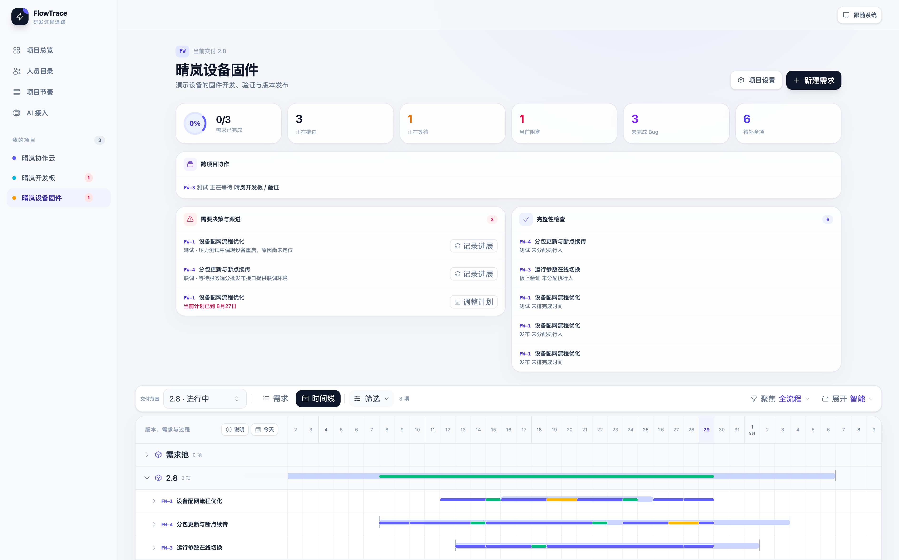

# FlowTrace

**让研发项目的计划、变化与真实过程留在同一条时间线上。**

[](https://github.com/LISTENAI/FlowTrace/actions/workflows/ci.yml)
[](LICENSE)
[](package.json)

FlowTrace 是面向研发团队、AI 友好的自部署项目过程追踪工具。它不是另一套
通用 Jira，而是围绕“一个需求是怎样被真正做完的”来组织信息：负责人、计划
基线、实际推进、等待、阻塞、Bug、返工和跨项目依赖都能被记录、解释和回溯。



> 截图使用仓库内置的虚构演示数据。

> [!IMPORTANT]
> FlowTrace 目前处于早期开发阶段（`0.1.x`）。数据模型、API 和 MCP 接口仍可能
> 在版本迭代中调整；当前版本尚未提供登录和权限隔离，只适合部署在可信内网或
> 受控私有网络中。

## 为什么使用 FlowTrace

很多项目工具能告诉你一件事现在是什么状态，却很难解释它为什么延期、在等谁，
以及计划改变之前原本是什么样。FlowTrace 把这些容易在会议和聊天中丢失的过程
留在项目里，让推进、交接和复盘都基于同一份事实。

- **计划改变，原计划不会消失。** 初始计划、当前计划和实际发生的过程各自保留，
  调整排期不再覆盖过去，也不必靠聊天记录还原来龙去脉。
- **一眼看见真正影响交付的事情。** 谁正在推进、哪里在等待、什么尚未分配、
  哪个 Bug 阻碍上线，都能从版本一路展开到具体工作。
- **流程服务于工作，而不是让工作迁就模板。** 团队可以复用常见研发节奏，也能
  为某个需求重新拆分阶段、负责人和时间，容纳软硬件协作与探索性任务。
- **状态背后始终有原因和时间。** 等待、阻塞、返工和计划变化不只是一个标签，
  而是可修正、可追溯的真实记录。
- **AI 看到的不是一张过时的任务表。** Web、MCP 和官方 Skill 共享同一套业务
  语义，AI Agent 可以查询变化、总结风险并在授权后更新项目。
- **轻量、自部署、数据留在团队手中。** 无需引入一套庞大的通用项目平台，即可
  建立适合研发团队的推进工作台。

## 五分钟体验

准备好 Docker Engine 和 Docker Compose v2 后，在仓库根目录运行：

```bash
docker compose up -d --build
```

开发 Compose 会启动 PostgreSQL、API 和支持热更新的 Web，并在空库中注入一次
虚构演示数据：

- Web：<http://localhost:5173>
- API：<http://localhost:3100/api>
- OpenAPI UI：<http://localhost:3100/api/docs>
- MCP Endpoint：`POST http://localhost:3100/mcp`

查看日志可运行 `docker compose logs -f`；停止并保留数据可运行
`docker compose down`。

## 正式部署

正式交付物是一个同时提供 Web、HTTP API、OpenAPI 文档和远程 MCP 的应用
镜像，数据存储在 PostgreSQL 中。生产 Compose 要求显式设置数据库密码，并
默认只监听本机回环地址：

```bash
export FLOWTRACE_POSTGRES_PASSWORD='请替换为随机生成的强密码'
docker compose -f compose.production.yml up -d --build
```

启动后访问 <http://localhost:3100>。如需从可信网络访问，可显式设置
`FLOWTRACE_PUBLISH_HOST`；通过 `FLOWTRACE_PUBLISH_PORT` 修改宿主机端口。

正式环境空库只会创建软件、固件和硬件三套可编辑的基础节奏，不会创建演示
项目、人员、需求或 Bug。PostgreSQL 数据默认保存在
`flowtrace_postgres_data` 卷中，升级前应使用 `pg_dump` 创建并验证备份。

> [!WARNING]
> 当前版本没有账号、登录和权限隔离。不要将 FlowTrace 直接暴露到公网；反向
> 代理和 HTTPS 不能替代身份认证。

外部 PostgreSQL、TLS、镜像参数、数据卷与升级说明见
[`docs/architecture/deployment.md`](docs/architecture/deployment.md)。

## AI 接入

FlowTrace 在应用端口提供无会话状态的远程 MCP Endpoint：

```text
POST http://localhost:3100/mcp
```

不同 AI Harness 的 MCP 配置格式各不相同，只需将上述地址作为远程 MCP 服务
地址。MCP 提供自描述的单项查询与写入工具；写入仍经过与 Web 相同的业务规则
和历史记录。调用方必须能够访问 FlowTrace 所在的可信网络。

官方 FlowTrace Skill 提供项目管理判断、对象消歧和写入安全策略：

```bash
npx skills add LISTENAI/FlowTrace
```

Skill 与 MCP 各司其职：Skill 指导 Agent 如何工作，MCP 负责访问真实数据和
执行操作。MCP 的资源、工具和调用约定见
[`docs/architecture/mcp.md`](docs/architecture/mcp.md)。

## 参与开发

本地开发推荐直接使用上面的开发 Compose。也可以在主机安装 Node.js 22、
npm 10 和可用的 PostgreSQL，然后运行：

```bash
npm ci
npm run dev
```

提交改动前应运行完整检查：

```bash
npm run format:check
npm run typecheck
npm test
npm run build
```

本地调试 MCP 的 stdio 入口时，它默认连接
`http://127.0.0.1:3100/api`：

```bash
npm run build -w @flowtrace/shared
npm run dev -w @flowtrace/mcp
```

可通过 `FLOWTRACE_API_URL` 覆盖 API 地址。提交 Issue 或 Pull Request 前请阅读
[`CONTRIBUTING.md`](CONTRIBUTING.md)；安全问题请按
[`SECURITY.md`](SECURITY.md) 私下报告，不要创建公开 Issue。

## 工程结构与文档

```text
packages/
├── web/       Vite、Vue SFC 与 Tailwind Web 界面
├── backend/   NestJS HTTP API、领域服务与 PostgreSQL 持久化
├── shared/    前后端和 MCP 共用的类型与 API 数据结构
└── mcp/       只通过 HTTP API 访问业务能力的第一方 MCP Server
skills/
└── flowtrace/ 官方 Agent Skill
docs/
├── architecture/ 实现架构与机器接口说明
└── product/      归档的产品需求
```

- [领域模型](docs/architecture/domain-model.md)
- [HTTP API](docs/architecture/http-api.md)
- [MCP 接口](docs/architecture/mcp.md)
- [正式部署](docs/architecture/deployment.md)
- [产品需求 v0.2](docs/product/requirements-v0.2.md)
- [AI 接入需求 v0.2](docs/product/ai-integration-v0.2.md)

面向 Coding Agent 的工程约束位于 [`AGENTS.md`](AGENTS.md)，不属于用户使用
文档。

## 许可证

FlowTrace 采用 [Apache License 2.0](LICENSE) 开源，版权归
Anhui Listenai Co., Ltd. 所有。归属声明见 [`NOTICE`](NOTICE)。
